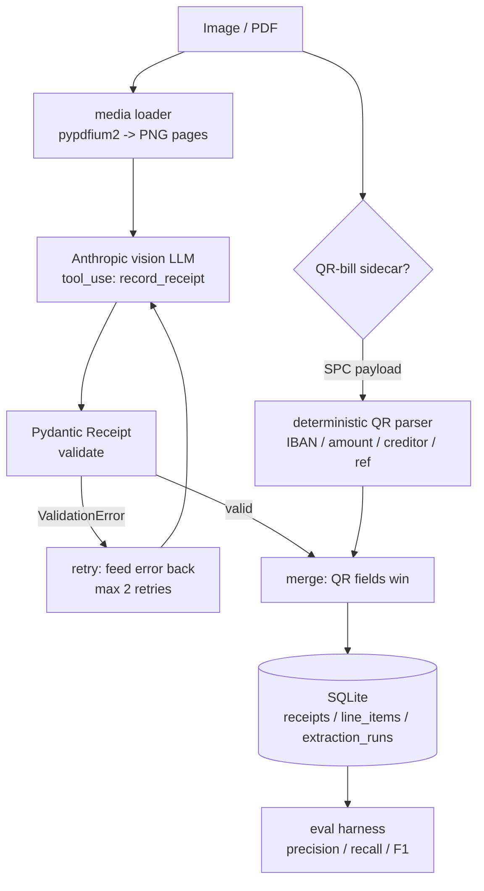
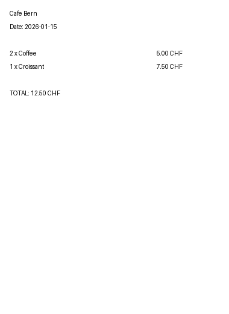

# receipt-extract


A production-shaped pipeline that turns a receipt or invoice (image / PDF) into
**validated, structured, queryable data**. It pairs a vision LLM with strict
schema enforcement, a deterministic Swiss QR-bill parser, and an offline
evaluation harness that produces real precision/recall/F1 numbers.

The design goal is trustworthiness: the model is never allowed to emit free-text
JSON, every extraction is validated against a Pydantic contract, and any field
the deterministic parser can prove (the QR-bill) overrides the model.

---

## Problem

Receipts are messy: inconsistent layouts, faded thermal print, multi-page PDFs,
foreign VAT rules. Naive "ask the LLM for JSON" pipelines fail in three ways:

1. **Malformed output** — JSON wrapped in prose, trailing commas, wrong types.
2. **Silent hallucination** — plausible but wrong totals that no one checks.
3. **No ground truth** — no way to know if a change made things better or worse.

`receipt-extract` addresses each: tool-use schema enforcement (1), Pydantic
consistency validators + QR-bill override (2), and a golden dataset with a
per-field metrics harness (3).

---

## Architecture



---

## Design decisions & tradeoffs

### 1. Deterministic QR-bill parser, not the LLM
Swiss QR-bills embed a fixed-order `SPC` text payload (SIX standard). Parsing it
in code is exact, free, and auditable. Letting an LLM read the IBAN would add
cost, latency, and a hallucination surface for the one field that must be
correct. **Tradeoff:** the parser is spec-coupled and rejects unknown versions
rather than guessing — deliberately strict for a payments field.

### 2. Tool-use schema over JSON mode
We force the model to call a `record_receipt` tool whose `input_schema` is a
strict JSON Schema. The Anthropic API validates the model's arguments against
that schema before we ever see them, eliminating "JSON embedded in prose"
parsing. **Tradeoff:** slightly less flexible than free-form output, and the
schema must be kept in sync with the Pydantic model — worth it for reliability.

### 3. Validation-driven retry loop
Business rules the schema can't express (total ≈ sum of line items, VAT
consistency, no future dates) live in Pydantic validators. On a
`ValidationError`, the exact error text is fed back to the model as a
`tool_result` so it can self-correct, up to 2 retries, then `ExtractionFailed`
is raised with the raw response logged. **Tradeoff:** up to 3 API calls per
receipt in the worst case; capped to bound cost.

### 4. Money as Decimal strings everywhere
Monetary values are `Decimal` in the models and stored as TEXT in SQLite. This
avoids binary float rounding that would break the `total ≈ sum(items)` check.

### 5. QR fields win on conflict
When a QR-bill is present its amount/currency/creditor are authoritative. If the
QR total contradicts the LLM's line items beyond tolerance, the line items are
dropped to keep the stored receipt internally consistent.

---

## Example

A synthetic golden receipt (`data/golden/easy_1.png`) and the structured record
the pipeline maps it to. The image below is the actual PNG shipped in the repo;
the JSON is the real ground-truth (`data/golden/easy_1.truth.json`).



```json
{
  "vendor": "Cafe Bern",
  "date": "2026-01-15",
  "currency": "CHF",
  "total": "12.50",
  "vat_rate": null,
  "vat_amount": null,
  "line_items": [
    { "description": "Coffee",    "quantity": "2", "unit_price": "2.50", "amount": "5.00" },
    { "description": "Croissant", "quantity": "1", "unit_price": "7.50", "amount": "7.50" }
  ],
  "payment_method": "card",
  "confidence": null
}
```

Every monetary value is a `Decimal` string, and the Pydantic contract enforces
`total ≈ sum(line_items.amount)` before the record is stored.

---

## Evaluation results (offline)

Live evaluation needs an `ANTHROPIC_API_KEY`. To keep the project fully
reproducible offline, the harness scores **recorded predictions** (`*.pred.json`)
against ground truth (`*.truth.json`). The two "hard" receipts carry deliberately
injected extraction errors (wrong VAT rate/amount, a dropped line item, a wrong
date) so the numbers are honest rather than a perfect 1.0.

Run it yourself: `receipt-extract eval`

| Field            | Precision | Recall |   F1 | tp/fp/fn |
|------------------|----------:|-------:|-----:|:--------:|
| vendor           |      1.00 |   1.00 | 1.00 |  10/0/0  |
| date             |      0.90 |   0.90 | 0.90 |   9/1/1  |
| currency         |      1.00 |   1.00 | 1.00 |  10/0/0  |
| total            |      0.90 |   0.90 | 0.90 |   9/1/1  |
| vat_rate         |      0.00 |   0.00 | 0.00 |   0/1/1  |
| vat_amount       |      0.00 |   0.00 | 0.00 |   0/1/1  |
| payment_method   |      1.00 |   1.00 | 1.00 |   7/0/0  |

**Macro-F1: 0.69** · receipts evaluated: 10

VAT scores are 0 by construction: the single VAT-bearing hard receipt has an
injected wrong rate, so with n=1 the field is either fully right or fully wrong.
This is exactly the kind of signal the harness exists to surface. A full JSON
report is written to `eval_report.json`.

---

## Setup

Requires Python 3.11 (no `uv` needed).

```bash
python3 -m venv .venv
.venv/bin/pip install -r requirements-dev.txt
.venv/bin/pip install -e .

# run the test suite
.venv/bin/pytest --cov=receipt_extract

# run the offline evaluation (no API key required)
.venv/bin/receipt-extract eval
```

### Example session

```bash
# Offline eval against the shipped golden dataset
$ receipt-extract eval
field               prec  recall      f1    tp/fp/fn
...
Report written to eval_report.json

# Live ingestion (requires ANTHROPIC_API_KEY)
$ export ANTHROPIC_API_KEY=sk-ant-...
$ receipt-extract ingest data/golden/qr_1.png --db receipts.db
[stored] receipt #1: Elektro AG 250.00 CHF
```

Ingestion is idempotent: re-running on the same file returns the cached receipt
(keyed by SHA-256 of the file contents) instead of re-calling the API.

### Web UI (optional)

A small Gradio UI wraps the same pipeline, with three tabs:

- **Extract (live)** — upload an image / PDF and run a real extraction. Paste an
  Anthropic API key directly in the UI (used per-request, never logged or
  stored) or leave the field blank to use the `ANTHROPIC_API_KEY` environment
  variable.
- **Offline demo** — browse the golden dataset: recorded prediction vs. ground
  truth, field by field. Zero API calls.
- **Evaluation** — score every golden receipt (precision / recall / F1).

The offline tabs auto-load on open, so the UI is useful the moment it starts —
no key required.

```bash
.venv/bin/pip install -r requirements-ui.txt   # or: pip install -e ".[ui]"
.venv/bin/receipt-extract-ui                   # opens http://127.0.0.1:7860
```

Every UI action is also reachable through Gradio's auto-generated API (the
*Use via API* button in the footer), e.g. via `gradio_client`:

```python
from gradio_client import Client
Client("http://127.0.0.1:7860").predict(api_name="/run_eval")
```

The UI's pure render/diff helpers live in `webui/render.py` (Gradio-free, unit
tested in `tests/test_webui.py`); the Gradio wiring is isolated in `webui/app.py`.

> **Note:** the in-UI key field is meant for local use. Do not expose this UI
> publicly (`share=True` / a deploy) and have people paste real keys without
> HTTPS and auth in front of it.

---

## Project layout

```
src/receipt_extract/
  models/       Pydantic Receipt / LineItem / Confidence + validators
  qrbill/       deterministic Swiss QR-bill (SPC) parser
  extraction/   vision LLM client, tool schema, media loader, retry loop
  storage/      SQLite repository (receipts / line_items / extraction_runs)
  eval/         golden data generator + precision/recall/F1 harness
  pipeline.py   detect QR -> extract -> merge -> store (idempotent)
  cli.py        `receipt-extract ingest|eval`
  webui/        optional Gradio UI (render.py = pure helpers, app.py = wiring)
data/golden/    10 synthetic receipts (PNG + truth + recorded prediction)
tests/          unit + integration tests
```

---

## Limitations (honest)

- **No live LLM calls are tested.** There is no API key in the build
  environment, so the extraction module is exercised only with a mocked client.
  The real-API path is implemented and guarded but has not been run end-to-end.
- **QR detection uses a sidecar, not pixel decoding.** The pipeline reads the
  QR payload from a `<file>.spc` sidecar. Decoding a QR code from the image
  itself (e.g. via `pyzbar`) is intentionally out of scope.
- **Offline eval scores recorded predictions**, not live model output. The
  numbers are real but reflect the injected fixtures, not current model quality.
- **Currency validation uses a common ISO-4217 subset**, not the full registry.
- **Synthetic data only.** All receipts are generated with Pillow; no real
  receipts are included.
- **Cost tracking is a plumbed field**, not a live per-model price table; the
  CLI passes `cost_usd=0.0` until wired to real pricing.
